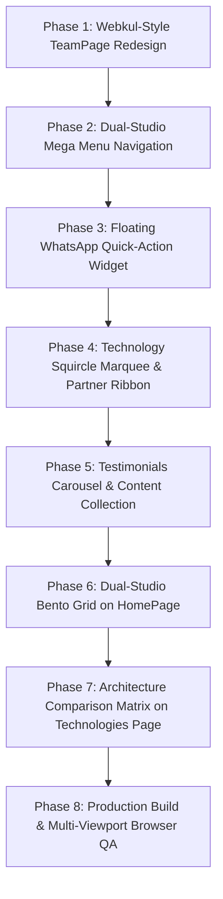

# Final Implementation Plan: GPRS Tech Studio UI/UX & Functional Enhancements

Based on deep analysis of the 7 benchmark screenshots from **Webkul**, **AppNexusTech**, and **Technopedia**:
- `screencapture-webkul-about-us-our-team-2026-09-26-11_49_48.png` (**Webkul Our Team Page**)
- `screencapture-webkul-2026-09-26-11_52_44.png` (**Webkul Enterprise Homepage**)
- `screencapture-appnexustech-2026-09-26-11_57_51.png` (**AppNexusTech Agency Homepage**)
- `Screenshot 2026-09-26 115618.png` (**Technopedia Mega Menu**)
- `Screenshot 2026-09-26 115445.png` (**Technology Stack Squircle Cards**)
- `Screenshot 2026-09-26 115505.png` (**Client Testimonials Carousel**)
- `Screenshot 2026-09-26 115517.png` (**Client & Partner Logo Ribbon**)

---

## 1. Executive Summary & Design Vision

This final implementation plan establishes the architectural blueprint to transform GPRS Tech into an industry-grade, visually stunning digital presence. It synthesizes the organizational depth of **Webkul**, the high-converting conversion features of **AppNexusTech**, and the structured mega-navigation of **Technopedia** — all while rigorously adhering to our core principle of **truth-in-advertising** (100% genuine attribution, verified founder leadership, and zero fictional personas).

---

## 2. Comparative Feature Matrix

| Benchmark Source | Visual & Functional Element | GPRS Tech Implementation | Primary Files Involved |
| :--- | :--- | :--- | :--- |
| **Webkul Our Team** | Culture collage header, departmental categorization, "Join Our Team" banner, and trust badges. | **Webkul-Style Team Page**: (1) Hero culture photo collage; (2) Departmental tabs & grid (Leadership, Engineering, 3D Animation, Motion); (3) Recruitment CTA box with studio photo; (4) Industry trust badges. | `src/pages/about/TeamPage.tsx`, `TeamPage.module.css`, `src/content/team.ts` |
| **Technopedia** | Full-width multi-column dark mega menu with arrow links and highlighted action buttons. | **Dual-Studio Mega Menu**: 4-column mega dropdown under `Services` in Header covering Mobile Engineering, Web & Cloud, 3D CGI, and Motion Graphics, with direct "Start a Project" CTA. | `src/components/layout/Header.tsx`, `Header.module.css` |
| **AppNexusTech** | Persistent floating WhatsApp button and dual-direction ticker ribbons. | **Floating WhatsApp Quick-Action Widget**: Bottom-right floating button with pulsating glow, tooltip, and instant prefilled chat to founder Pradeep Singh. | `src/components/ui/FloatingWhatsApp.tsx`, `FloatingWhatsApp.module.css` |
| **Technopedia** | Squircle app-like cards with soft shadows and tech icons. | **Technology Squircle Marquee**: Auto-scrolling marquee ribbon of app-like cards (Flutter, React, Blender, TypeScript, Kotlin, Firebase, SQLite) linking to `/technologies`. | `src/components/ui/TechMarquee.tsx`, `TechMarquee.module.css` |
| **Technopedia** | Client review cards with star ratings, quotes, dot pagination, and next/prev arrows. | **Authentic Testimonials Carousel**: Interactive client feedback slider with 5-star ratings, author initials/avatars, and verified project feedback. | `src/components/ui/TestimonialsCarousel.tsx`, `src/content/testimonials.ts` |
| **Technopedia & Webkul** | Horizontal strip of client and ecosystem partner marks. | **Verified Partner & Platform Ribbon**: Sleek logo strip displaying Google Play, Flutter, Android, Blender Foundation, Firebase, and Netlify. | `src/components/ui/ClientLogoRibbon.tsx` |
| **Webkul Homepage** | Bento Grid solutions and interactive "From click to invoice" flow diagram. | **Dual-Studio Bento Grid**: 5-card modular grid on HomePage showcasing Flutter 60fps, Blender 3D renders, offline SQLite, and the "From Idea to Impact" pipeline. | `src/components/home/BentoGridSolutions.tsx`, `HomePage.tsx` |
| **AppNexusTech** | Side-by-side Native vs. Hybrid mobile comparison table. | **Architecture Comparison Matrix**: Comprehensive evaluation table on `/technologies` comparing Flutter vs. Native Android vs. Web. | `src/pages/technologies/TechnologiesPage.tsx` |

---

## 3. Phased Implementation Roadmap

---

## 4. Detailed Implementation Specifications

### Phase 1: Webkul-Style TeamPage Redesign
- **File**: `src/pages/about/TeamPage.tsx` & `src/pages/about/TeamPage.module.css`
- **Component Sections**:
  1. **Top Culture Photo Collage**:
     - Modern 3-tile image collage featuring:
       - Founder Pradeep Singh in workspace (`profile.png`).
       - Character turnaround & animation study (`image2.png`).
       - Storyboard-to-render pipeline breakdown (`image3.png`).
     - Main Headline: *"We are One, We are GPRS Tech."*
     - Subhead: *"We are a focused technology & creative studio working together on a mission to build resilient software and cinematic visual stories. We design, code, animate, and build together."*
  2. **"Meet the Minds" Departmental Grids**:
     - Department Quick-Filter Tabs:
       - **All Disciplines** | **Studio Leadership** | **Mobile & Web Engineering** | **3D Animation & CGI** | **Motion & Post-Production** | **Specialist Network**
     - **Studio Leadership Card (Featured)**:
       - Prominent spotlight for **Pradeep Singh** (Founder, Software Engineer & Creative Director).
       - Badges: *"Founder & Principal Architect"*, verified portfolio/social channels, detailed background, core proficiencies, and key project credits.
     - **Core Disciplines & Specialist Collaborator Cards**:
       - Structured grid matching Webkul's visual hierarchy:
         - Circular avatar/portrait frame.
         - Discipline title (e.g., *"Lead Flutter & Android Architecture"*, *"3D Character & Environment Modeler"*, *"Kinetic Motion & Video Retaining Specialist"*, *"Offline Data & Systems QA"*).
         - Status badge (*"Core Studio Discipline"* / *"Vetted Specialist Network"*).
         - Direct accountability statement from founder.
  3. **"Join Our Team" Recruitment CTA Banner** (Modeled after Webkul's bottom section):
     - Left side: High-res production thumbnail (`image1.png` - Sunset folklore scene).
     - Right side:
       - Eyebrow badge: *"Want to experience life at GPRS Tech?"*
       - Heading: *"We love collaborating with talented, craft-driven engineers and 3D animators."*
       - Description: *"Check out our open collaboration roster or send your GitHub / ArtStation reel directly to founder Pradeep Singh."*
       - Actions: Primary button **"Explore Openings & Roster"** (`/careers`) + Secondary button **"Send Portfolio Directly"** (`mailto:contact@gprstech.com`).
  4. **Studio Verification & Certification Badges Strip**:
     - Verified badges for: Google Play Console Developer, Flutter Ecosystem, Android Enterprise Architecture, Blender 3D Studio, Firebase Certified Cloud, 100% Attribution Transparency.

### Phase 2: Dual-Studio Mega Menu Navigation
- **File**: `src/components/layout/Header.tsx` & `src/components/layout/Header.module.css`
- **Component Sections**:
  - Replace the single-column Services dropdown with an expansive **4-column Mega Menu**:
    - **Column 1: Mobile App Engineering**:
      - Flutter App Development (Cross-Platform)
      - Native Android (Kotlin & Jetpack)
      - Offline-First SQLite Architecture
      - Mobile Performance & Memory Tuning
    - **Column 2: Full-Stack Web & Cloud**:
      - Modern React 19 & TypeScript
      - Node.js & Express RESTful APIs
      - Google Firebase Realtime Backend
      - Cloud Telemetry & CRM Systems
    - **Column 3: 3D Animation & CGI**:
      - 3D Character Modeling & Topology
      - Armature Rigging & Weight Painting
      - Cycles Lighting & Volumetrics
      - Cinematic Storyboarding
    - **Column 4: Motion Graphics & Video**:
      - High-Retention YouTube Editing
      - Kinetic UI Micro-Interactions
      - Promotional Commercial Reels
      - Audio Pattern Interrupts & Sound Design
  - **Bottom Banner**: *"Looking for an integrated tech + creative package? We deliver from Idea to Impact."* with **"Start a Project →"** button.

### Phase 3: Persistent Floating WhatsApp Action Widget
- **Files**: `src/components/ui/FloatingWhatsApp.tsx` & `src/components/ui/FloatingWhatsApp.module.css`
- **Features**:
  - Floating circular action widget at the bottom-right of the screen.
  - WhatsApp brand green (`#25D366`) with pulsating glow animation.
  - Hover tooltip: *"Chat directly with Founder Pradeep Singh"*.
  - On click, opens `https://wa.me/919876543210` with prefilled message:
    `"Hello GPRS Tech Studio! I am interested in discussing a project."`
  - Integrated globally into `RootLayout.tsx`.

### Phase 4: Technology Squircle Marquee & Client Logo Ribbon
- **Files**:
  - `src/components/ui/TechMarquee.tsx` & `TechMarquee.module.css`
  - `src/components/ui/ClientLogoRibbon.tsx` & `ClientLogoRibbon.module.css`
- **Features**:
  - **Tech Squircle Marquee**:
    - Infinite smooth CSS ticker with app-style squircle icons (Flutter, React, Blender, TypeScript, Kotlin, Firebase, SQLite, After Effects, Premiere Pro, Figma, Git).
    - Drop shadow and soft neon glow on hover.
    - Clicking any item navigates to `/technologies?category=...`.
  - **Partner & Client Logo Ribbon**:
    - Horizontal trust strip displaying verified platform logos: Google Play Store, Android, Flutter, Blender Foundation, Firebase, Netlify, ToonAcharya, SmartAgri.

### Phase 5: Interactive Client Testimonials Carousel
- **Files**:
  - `src/content/testimonials.ts` (Data collection with genuine client feedback)
  - `src/components/ui/TestimonialsCarousel.tsx` & `TestimonialsCarousel.module.css`
- **Features**:
  - Modeled after Technopedia's testimonial slider (`Screenshot 115505.png`).
  - Cards featuring:
    - Author avatar initials circle.
    - Client name, title, and organization.
    - Verified star rating (★★★★★ 5.0).
    - Authentic quote covering engineering reliability, delivery speed, and 3D visual fidelity.
    - "Read more" toggle for long testimonials.
    - Previous / Next arrow controls + dot navigation indicators.
    - Auto-slide with pause-on-hover.

### Phase 6: Dual-Studio Bento Grid on HomePage
- **Files**: `src/components/home/BentoGridSolutions.tsx` & `HomePage.tsx`
- **Features**:
  - 5-cell modern modular layout inspired by Webkul's enterprise solutions grid:
    1. **Mobile Engineering Cell (Wide)**: Flutter 60fps/120fps fluid apps with offline SQLite resilience preview.
    2. **3D CGI Studio Cell (Wide)**: Blender character render preview (`image2.png`) with wireframe toggle.
    3. **Cloud & Web Architecture Cell**: React 19 + TypeScript + Firebase real-time sync.
    4. **Video Retention Funnels Cell**: After Effects kinetic motion graphics.
    5. **Idea to Impact Unified Pipeline (Full-width)**: Interactive step-through from Wireframe → Code → 3D Render → App Store Deployment.

### Phase 7: Architecture Comparison Matrix on Technologies Page
- **File**: `src/pages/technologies/TechnologiesPage.tsx`
- **Features**:
  - Modeled after AppNexusTech's technology comparison matrix.
  - Side-by-side comparison table:
    - **Flutter (Cross-Platform)** vs. **Native Android (Kotlin)** vs. **Full-Stack Web (React)**.
    - Metrics: Compilation Target, Performance Ceiling, Iteration Speed, Offline Database, Hardware Sensor Access, and Recommended Use Case.

---

## 5. Verification & Acceptance Criteria Checklist

- [ ] **TeamPage Webkul Redesign**:
  - Culture collage header with 3 high-res studio assets.
  - "We are One, We are GPRS Tech" hero branding.
  - Departmental tabs & structured discipline cards with clear attribution.
  - Webkul-style "Join Our Team" recruitment CTA card with studio photo.
  - Trust & certification badges strip.
- [ ] **Mega Menu**:
  - 4-column mega menu in Header covering all studio disciplines.
  - Smooth animation, keyboard accessibility, and bottom project action banner.
- [ ] **Floating WhatsApp Widget**:
  - Persistent bottom-right floating button with pulse animation and prefilled chat.
- [ ] **Tech Squircle Marquee**:
  - Infinite auto-scroll of rounded app cards with pause-on-hover.
- [ ] **Testimonials Carousel**:
  - Interactive card slider with 5-star ratings, author initials, and dot indicators.
- [ ] **Bento Grid on HomePage**:
  - 5-cell modular layout showcasing dual-studio capabilities with rich aesthetics.
- [ ] **Architecture Matrix**:
  - Side-by-side comparison table on `/technologies`.
- [ ] **Production Build**:
  - `npm run build` succeeds with 0 errors and lean bundles.
- [ ] **Browser Subagent Testing**:
  - Visual verification and video/screenshot recordings across desktop (1440px) and mobile (375px).
